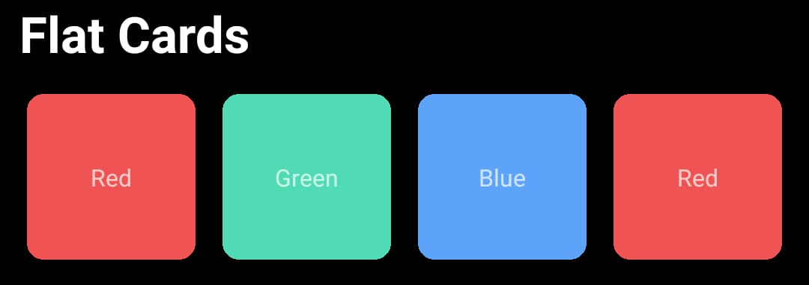
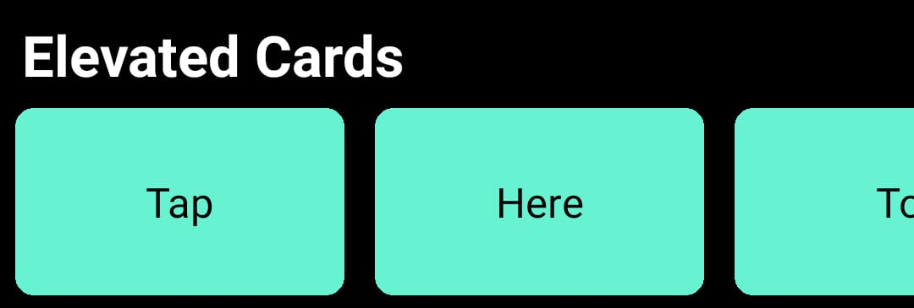
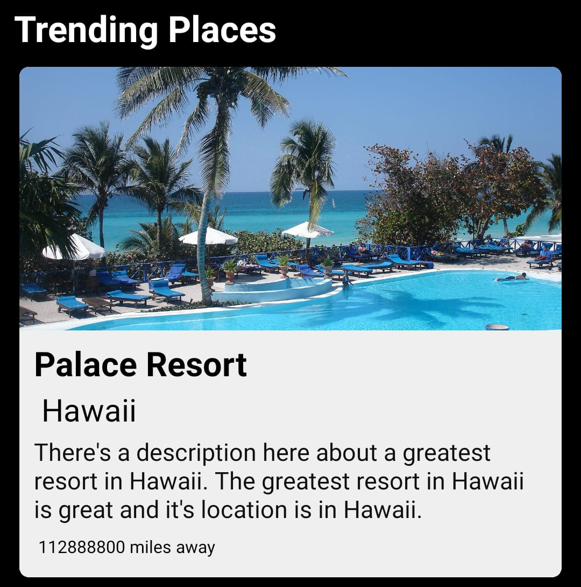

This is a study project about styling in React Native.

## Flat Cards
>Static cards to displaying different types of content or informations.

## Elevated Cards
>Cards positioned horizontally in a scroller to display content.

## Fancy Cards
>Cards para exibir detalhes e informações sobre conteúdos.

## Action Cards
>Static cards that display information and texts that redirect to web pages.

## Contact Lists
>A list of users displayed in a horizontal scroller that shows user image, name and a status phrases

